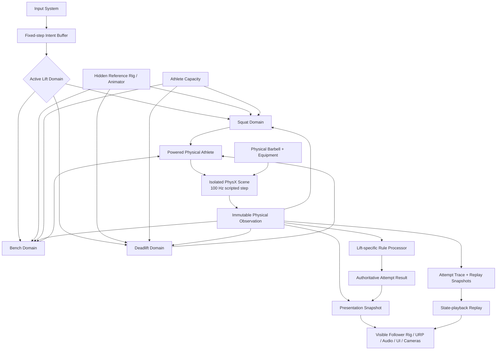

# Read Me First — Executive Freeze

**Document ID:** `00`  
**Authority:** `MASTER_SPEC_V1`  
**Status:** `FROZEN`  
**Dependencies:** None

## Repository verification

- Confirm the repository still uses Unity 6000.3.22f1 LTS and record exact package-lock versions.
- Confirm the exact Quaternius source pack and imported license file.
- Confirm whether current scenes can move physical simulation into an isolated additive PhysicsScene without breaking M1/M2 presentation.

## Evidence register

The design distinguishes five evidence layers.

| Class | Meaning | Examples in this bundle |
|---|---|---|
| `SOURCE_DIRECT` | A value or rule copied from a named source with a locator. | IPF bar dimensions; Winter segment mass fractions. |
| `SOURCE_DERIVED` | A deterministic calculation from direct source values. | Total loaded bar mass; whole-body COM. |
| `ENGINEERING_DERIVED` | A quantity computed from engine state under an explicit model. | Modeled joint-drive demand; state-derived bar acceleration. |
| `GAME_CALIBRATION` | A deliberate parameter selected for playability or numerical behavior. | Drive gains; fatigue rate; referee settle window. |
| `PROVISIONAL` | A proposed value that must pass an implementation fixture. | Solver iterations; grip compliance; visual tolerances. |
| `NOT_OBSERVABLE` | A quantity that the game does not have evidence to claim. | True muscle force, tendon force, biological joint loading. |

### Book sources used

1. Jason Gregory, *Game Engine Architecture*, 4th ed., Volumes I and II, CRC Press, 2026: runtime architecture, game-loop phasing, animation/physics integration, collision and rigid-body integration, game objects, debugging and performance.
2. Ian Millington, *Game Physics Engine Development*, 2nd ed., CRC Press, 2010: rigid-body inertia, contacts, friction, penetration resolution, iterative solver limitations and stability.
3. Christer Ericson, *Real-Time Collision Detection*, Morgan Kaufmann/CRC Press, 2005: geometric and floating-point robustness, tolerances, thick primitives and coherent queries.
4. Stephen J. Thomas, Joseph A. Zeni and David A. Winter, *Winter's Biomechanics and Motor Control of Human Movement*, 5th ed., Wiley, 2023: anthropometry, multisegment COM, kinematics, filtering, work/power, balance and simulation claim limits.
5. Karl J. Åström and Richard M. Murray, *Feedback Systems*, 2nd ed., Princeton University Press, 2021: reference tracking, damping, saturation, discrete implementation and system/control co-design.
6. R. C. Hibbeler, *Engineering Mechanics: Dynamics*, 14th ed., Pearson, 2016; Joaquim A. Batlle and Ana Barjau Condomines, *Rigid Body Dynamics*, CUP, 2022: Newton–Euler mechanics, momentum, work/energy and frame discipline.
7. Kevin M. Lynch and Frank C. Park, *Modern Robotics*, CUP, 2017: rigid transforms, twists/wrenches, constrained dynamics and the boundary between useful control concepts and research-grade whole-body control.
8. Richard L. Lieber, *Skeletal Muscle Structure, Function, and Plasticity*, 3rd ed., 2010: force–length/velocity concepts and the limits of translating muscle physiology into a game actuator.
9. Franz Lanzinger, *3D Game Development with Unity*, 2022, and Penny de Byl, *Holistic Game Development with Unity*, 2012: Unity production workflow, testing, release, presentation and the integration of design, art and programming.

### Web and primary-rule sources verified on 2026-08-28

- International Powerlifting Federation, *Technical Rule Book*, version 3, effective 2026-03-01.
- International Powerlifting Federation, IPF GL Points materials.
- Unity 6 official Manual and Scripting API: ConfigurableJoint, JointDrive, Physics.Simulate, Rigidbody interpolation, collision detection modes, fixed timestep and Input System update modes.
- Quaternius, *Universal Base Characters*, August 2025, official page: humanoid rig, superhero proportions and CC0 distribution. The exact imported project asset remains repository-verification work.
- Peer-reviewed powerlifting biomechanics indexed by PubMed, including Escamilla et al. (2000) on conventional versus sumo deadlift, van den Tillaar and Ettema (2010) on the bench sticking period, van den Tillaar et al. (2020) on squat bar placement, Gundersen et al. (2025) on deadlift variants, and the 2025 systematic review of load/fatigue effects across the three lifts.

### Evidence ceiling

The books and studies constrain motion, geometry, terminology and analysis choices. They do **not** validate this game's actuator parameters as human torque, establish individual injury risk, or convert a PhysX constraint drive into a measured biological muscle model. Every such boundary is explicit in `ENGINEERING/65_CLAIMS_PROVENANCE.md`.
# EXECUTIVE FREEZE

## A. MASTER DESIGN THESIS

The shipping product is a **human-centered powerlifting game** whose mechanical truth comes from one finite, physical athlete and one physical barbell simulated by PhysX. The player supplies lift-specific intent. A hidden reference rig describes the technique the athlete is attempting; force-limited powered joints attempt to follow that reference; contacts, gravity, load, geometry and finite authority determine what actually happens.

The design deliberately stops below a musculoskeletal simulator and below a research humanoid controller. It uses enough mechanics and biomechanics to make squat, bench press and deadlift visibly distinct, causally coherent and load sensitive. It uses explicit approximation to remain debuggable and shippable.

The final rule is:

> **Reference motion states the attempt. PhysX realizes the attempt. Observations establish truth. Rules judge truth. Presentation communicates truth.**

## B. PRODUCT NORTH STAR

A player selects an attempt, walks onto a convincing competition platform, sees and controls a real visible powerlifter, feels the difference between a warm-up and a maximal load, succeeds or fails for understandable physical and technical reasons, receives referee lights, then studies a replay whose measurements never pretend to be more validated than the simulation supports.

The player primarily watches the **human and bar**, not a dashboard. The analysis layer is a reward for understanding performance, not the visual center of the lift.

## C. FINAL ARCHITECTURE DIAGRAM



### Runtime ownership

1. `PhysicsTickDriver` is the only owner of simulation time.
2. The active lift domain is the only owner of lift phase, reference selection and lift-specific physical intent.
3. `PoweredAthlete` is the only code allowed to write joint-drive targets.
4. PhysX is the only authority that changes physical rigid-body state.
5. `ObservationBuilder` reads state after the physics step and emits an immutable snapshot.
6. A lift-specific rules processor alone creates attempt truth.
7. Rendering, audio, UI and replay consume snapshots and cannot write back into truth.

## D. SHARED-VS-LIFT-SPECIFIC BOUNDARY

| Shared powered-athlete substrate | Squat-only | Bench-only | Deadlift-only |
|---|---|---|---|
| Humanoid bone binding | Back-bar saddle contact | Bench/body contact topology | Grounded/slack/free-bar modes |
| Segment rigid bodies and colliders | Squat depth geometry | Two-hand pressing grip | Two-hand pulling grip |
| Powered-joint adapter | Walkout and rerack | Start/touch/pause/press/rack | Pull-slack/floor-break/down |
| Capacity interface | COM-over-foot reference correction | Arch, leg drive and press bar path | Bar-over-midfoot setup |
| Input buffering | Squat phase/state machine | Bench phase/state machine | Deadlift phase/state machine |
| One authoritative bar Rigidbody | Squat failures and rules | Bench failures and rules | Deadlift failures and rules |
| Snapshot/replay infrastructure | Squat telemetry/test oracle | Bench telemetry/test oracle | Deadlift telemetry/test oracle |
| Rendering, cameras, save, CI | — | — | — |

A lifecycle-only `IPhysicalLift` contract is allowed. There is no generic `LiftDefinition` containing universal phases, contacts, joint targets or rules.

## E. PHYSICS REALISM LEVEL

`REALISM_LEVEL = PHYSICALLY_COHERENT_GAME_SIMULATION`

It includes:

- SI units, measured asset proportions and segment mass allocation;
- articulated rigid bodies with gravity, inertia, finite joint limits and finite powered drives;
- a single physical barbell with load-dependent mass and inertia;
- actual contact with platform, bench, rack, body and floor;
- physically realized tracking error, balance loss, grind, stall and collapse;
- deterministic rule geometry and traceable approximations.

It does not require exact biological torque, muscle recruitment, soft tissue deformation, validated ground-reaction force reconstruction or bitwise cross-platform determinism.

## F. WHAT WE EXPLICITLY DO NOT SIMULATE

- individual muscles, tendons, ligaments, cartilage or neural control;
- true internal joint reaction forces or bone-on-bone forces;
- clinically valid injury mechanisms or injury probability;
- force-plate-quality GRF or COP;
- bar steel finite-element flex in V1;
- deformable flesh or clothing;
- optimal-control/HQP/KKT/CWC/AWP/FWP whole-body solvers;
- exact referee perception or federation adjudication uncertainty;
- physiological adaptation as medical or coaching advice;
- physics replay by resimulation.

## G. COMPLETE ARTIFACT MANIFEST

The required bundle contains 67 Markdown authorities plus `manifest.json`. The dependency graph is encoded in that manifest. The ordering rule is:

1. product constitution and shared contracts;
2. three separate lift domains;
3. game/product systems;
4. presentation;
5. engineering/verification;
6. ordered implementation roadmap.

No implementation wave may depend on a later document without an explicit dependency edge.

## H. COMPLETE MILESTONE MAP

| Milestone | State | Product result | Exit gate |
|---|---|---|---|
| M1 | Done | Rules/simulation vertical slice | Historical 69 EditMode + 7 PlayMode tests |
| M2 | Done with limitations | Visible humanoid presentation slice | Historical 96 EditMode + 16 PlayMode tests and visual inspection |
| M3 | Next | Shipping physical-humanoid squat | Unloaded through supra-max ladder, rules, visual gate, Windows build |
| M4A | Planned | Independent physical bench press | Touch/pause/press/rack, failures, rules, visual gate |
| M4B | Planned | Independent conventional deadlift | Slack/floor break/knee pass/lockout/down, failures, rules |
| M5 | Planned | Full nine-attempt meet and broadcast | Attempt order, timers, lights, total, IPF GL mode |
| M6 | Planned | Recorded-state replay and analysis | Metric definitions, provenance, synchronized overlays |
| M7 | Planned | Career/product loop | Save, progression, events, difficulty and content |
| M8 | Planned | Release | Performance, accessibility, QA, provenance, packaging |
| Post-launch | Optional | Additional athletes, venues, modes | Never blocks V1 |

## Frozen high-level choices

| Decision | Choice |
|---|---|
| Physical execution | One isolated 3D PhysicsScene, explicitly stepped at 100 Hz |
| Render rate | Variable; target 60 fps; snapshot interpolation |
| Rig topology | Hidden reference rig + physical rig + visible follower rig |
| Physical authority | PhysX only |
| Actuation | Finite ConfigurableJoint drives through one PoweredJoint adapter |
| Drive mode | Slerp for ball/trunk joints; X & YZ for hinge-dominant joints, subject to fixtures |
| Capacity V1 | Calibrated finite joint-family capacity × activation × fatigue |
| Replay | Recorded-state playback |
| Rules baseline | Competition-style rules derived from IPF 2026, with every game simplification tagged |
| Deadlift V1 | Conventional only |
| Scoring | Total plus optional versioned IPF GL Points; DOTS is not the federation default |
| Source license intent | All Rights Reserved source; distributable/playable game binary under a separate EULA |
| Scientific claim | Physics-based, anthropometrically informed game simulation—not validated human biomechanics |

## Master invariants

`INV-001` through `INV-015` from the mission are binding. Additional frozen invariants:

- **INV-016:** one simulation clock and one call site for `PhysicsScene.Simulate`.
- **INV-017:** input edges are preserved when resampled into the physics clock.
- **INV-018:** no renderer, Animator, IK constraint or camera writes a physical transform.
- **INV-019:** no safety-rescue behavior can convert a failed lift into a success.
- **INV-020:** a rule threshold, numerical epsilon and visual tolerance are different named values.
- **INV-021:** exact imported asset licenses and package versions are verified before release.
- **INV-022:** the same snapshot that feeds rules is the source of the archived attempt trace.
- **INV-023:** every load ladder contains at least one expected success and one expected physical failure.
- **INV-024:** no metric called “torque utilization” is sourced from `ConfigurableJoint.currentTorque`.
- **INV-025:** a new lift style, such as sumo, receives its own domain rather than a contaminated generic lift model.

## Final response contract

```text
MASTER_SPEC_STATUS=PASS_WITH_OPEN_DECISIONS
OPEN_DECISIONS=Exact imported asset provenance; measured joint frames and bone landmarks; empirical ConfigurableJoint drive mapping; final minimum hardware target; licensed use of federation branding.
REPOSITORY_VERIFICATION_REQUIRED=YES
SHIP_V1_COMPLEXITY_ASSESSMENT=MODERATE_AND_BOUNDED
M3_READY_FOR_LUNA_IMPLEMENTATION=YES
M4A_BENCH_DESIGN_COMPLETE=YES
M4B_DEADLIFT_DESIGN_COMPLETE=YES
FULL_GAME_LIFECYCLE_DESIGNED=YES
PRIMARY_ARCHITECTURE_RISKS=Drive/limit calibration; overconstrained grip/contact loops; asset-frame errors; collision initialization; visual/physical rig divergence.
FIRST_LUNA_WAVE=W0_REPOSITORY_AUTHORITY_AND_EVIDENCE_BASELINE
```
