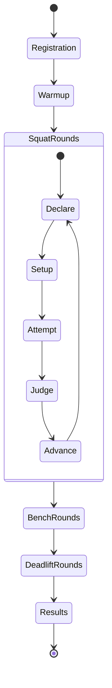

# Meet System

**Document ID:** `PSMS-GAME-40`  
**Authority:** `MASTER_SPEC_V1`  
**Status:** `FROZEN`  
**Dependencies:** `SQUAT/15_SQUAT_RULES.md`, `BENCH/25_BENCH_RULES.md`, `DEADLIFT/35_DEADLIFT_RULES.md`, `07_PHYSICAL_BARBELL_AND_EQUIPMENT.md`

## Repository verification

- Verify current official attempt ordering, tie-break, clock, declaration, and score rules.
- Inspect and preserve qualified M1 meet logic where compatible.
- Verify plate inventory and load increments against current competition equipment rules.

## Purpose

Orchestrate a competition from weigh-in/entry through nine attempts, commands, referee judgments, totals, placing,
broadcast flow, and results while keeping each lift's physical and rule domains independent.

## Domain model

```text
Meet
 ├─ MeetRuleset
 ├─ CompetitionClass
 ├─ AthleteEntry[]
 ├─ Flight[]
 ├─ Round[Squat 1..3, Bench 1..3, Deadlift 1..3]
 ├─ AttemptOrder
 ├─ RefereePanel
 ├─ AttemptClock
 ├─ Scoreboard
 └─ MeetResult
```

A `MeetAttempt` stores the selected lift domain ID, declared load, rack/equipment settings, start order, command and
judgment events, immutable trace reference, good/no-lift result, and reason codes. It never stores a generic list of phases.

## Competition sequence

1. Create/select athlete and competition class.
2. Confirm opening attempts for squat, bench, and deadlift.
3. Run squat rounds 1–3.
4. Run bench rounds 1–3.
5. Run deadlift rounds 1–3.
6. Compute best good lift in each discipline, total, placing, and optional current official points score.
7. Save results and unlock career consequences/content.

Attempt order follows declared load and competition ordering rules in the active ruleset. V1 can use a single-player meet
with simulated opponents, but the player's ordering and clock remain deterministic.

## Attempt selection

- Load increments obey the configured plate/loading rules.
- The next attempt may not be lower than the previous declared attempt under meet mode.
- Opening and subsequent declarations have deadlines.
- A selected load is frozen before scene setup.
- Training mode may relax declaration rules but uses the same physical athlete.

## Referee command authority

Each lift-specific rule processor requests/receives its legal commands through `MeetRefereeCoordinator`. The coordinator
does not inspect bones or move bodies. It timestamps:

- Squat: `SQUAT`, `RACK`.
- Bench: `START`, `PRESS`, `RACK`.
- Deadlift: `DOWN`.

Commands can be fully deterministic in V1: issue when the relevant rule-ready predicate remains true for its configured
dwell. Optional timing variance is cosmetic/presentation and cannot create an impossible command.

## Judgment

A frozen `AttemptJudgment` contains:

```text
physical_completion
rule_result
primary_reason
secondary_reasons[]
three_light_display
ruleset_id
trace_hash
judgment_tick
```

The canonical result is deterministic. Three lights may mirror one canonical result in V1. Later judge profiles must be
versioned and cannot silently reinterpret geometry.

## Total and placing

For each lift, the best successful attempt contributes to total. No successful attempt in a discipline yields no total
under the meet ruleset. Primary placing is total within class; tie-break logic is ruleset data and must be verified against
the current competition rules.

Optional GL/IPF points are implemented as a versioned scoring module whose coefficients, sex/category definitions, and
effective dates are stored in data. No coefficient is hard-coded from memory. The UI distinguishes official-source score
from game ranking score.

## Simulated opponents

V1 opponents are result generators, not hidden physics simulations. Their attempt outcomes derive from seeded athlete
profiles and meet-performance distributions, with visible declared loads and results. They never alter the player's
physical model. A later spectator/replay mode may show authored opponent lift clips.

## Attempt clock

The clock is a meet-domain timer, separate from physics time. Pause behavior is mode-specific:

- strict meet: opening the pause menu pauses local game presentation but marks the attempt suspended; competitive online
  mode is out of scope;
- training: normal pause;
- replay: independent timeline.

Clock expiry produces a rule/control failure before the lift begins or according to active ruleset semantics.

## Equipment/rack settings

Squat rack height, bench rack height, safety configuration, and plate plan are frozen per attempt. Equipment is checked
before activating physics. Invalid setup blocks the attempt rather than allowing a depenetration failure.

## State machine



Round/attempt counters bound this loop; completion moves to the next discipline.

## Failure handling

- A scene/physics initialization fault does not consume an attempt in development; release behavior returns to safe setup
  and logs a technical fault.
- Player abort after attempt start is a failed attempt.
- Crash recovery may restore the meet before the current attempt, never fabricate a judgment.
- Safety presentation runs after the attempt outcome is frozen.

## Tests

- Nine-attempt happy path and all-no-lift path.
- Best-lift/total calculations.
- Attempt declaration monotonicity and plate loading.
- Ordering/tie-break fixtures from verified rules.
- Command sequence delegated correctly per lift.
- Trace hash and result immutability.
- Attempt clock expiry.
- Save/reload between rounds.
- Simulated opponent seed determinism.
- Scoring-coefficient version mismatch fails closed.
- Presentation lights cannot alter result.

## SHIP_V1 / LATER / RESEARCH / OUT_OF_SCOPE

**SHIP_V1:** single-player meet, three attempts/lift, commands, lights, total, seeded opponents, results.  
**LATER:** federated rulesets, richer flights, official score coefficient updates, local multiplayer.  
**RESEARCH:** physically simulated opponents.  
**OUT_OF_SCOPE:** real-money competition, online anti-cheat, federation certification.
